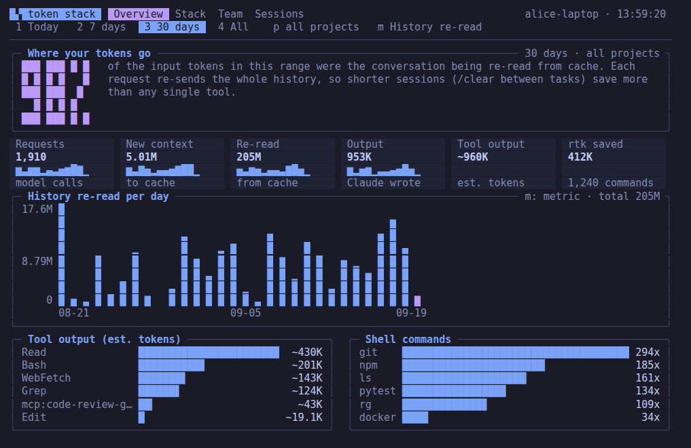
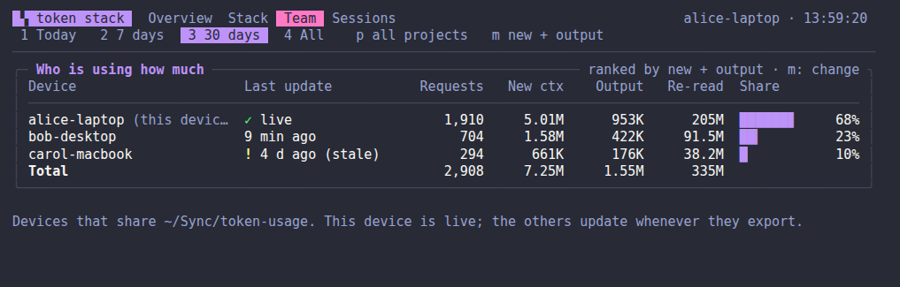
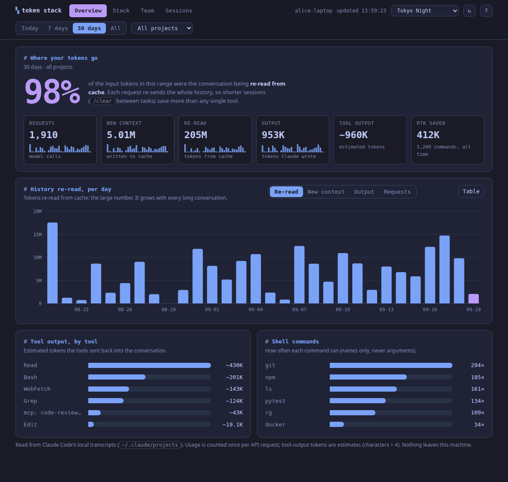
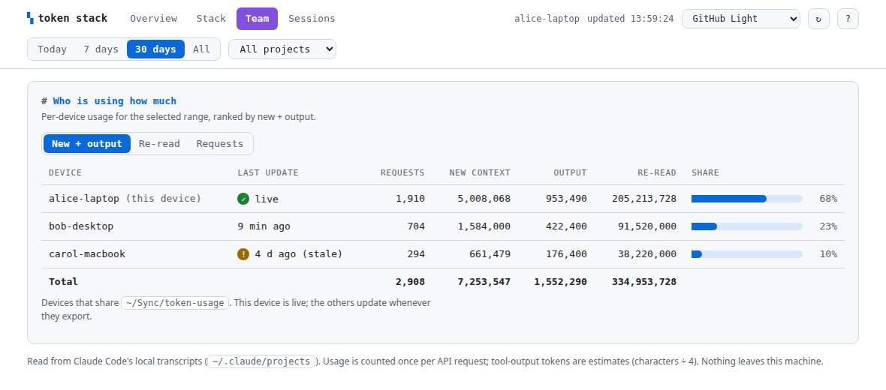

# multi-subagents

[](https://github.com/rohithkh4b3kr3/multi-subagents/actions/workflows/ci.yml) [](LICENSE)

A one-command setup that makes [Claude Code](https://docs.claude.com/en/docs/claude-code) read less, so sessions last longer and cost less, without changing the quality of the code or answers.

> **Status:** early, open source (Apache-2.0), **not affiliated with Anthropic**. Developed and tested on Ubuntu. CI runs the unit tests and dry-runs both installers on Linux, macOS and Windows; real-machine reports from macOS and Windows are welcome.

It combines six open-source token-saving tools, gives each **one job** so they don't fight each other, and adds four role-based agents (one of them can be your default agent) that know which tool to use for what.

| Tool | Its one job here | Where it acts |
|---|---|---|
| [rtk](https://github.com/rtk-ai/rtk) | Compress shell output (`git`, tests, `ls`, `grep`, `docker`, ...) | Hook on Bash calls |
| [code-review-graph](https://github.com/tirth8205/code-review-graph) | Code graph: callers, callees, tests, blast radius of a change | MCP server |
| [token-savior](https://github.com/mibayy/token-savior) | Read or edit one symbol instead of a whole file; project memory | MCP server |
| [context-mode](https://github.com/mksglu/context-mode) | Keep big outputs (logs, pages) in a sandbox and search them; survive context compaction | Claude Code plugin |
| [graphify](https://github.com/Graphify-Labs/graphify) | Whole-project and docs map (code, docs, PDFs, schemas) as a `/graphify` skill; local and free for code | Claude Code skill (loads only when used) |
| [caveman](https://github.com/JuliusBrussee/caveman) | Make Claude's *replies* shorter (terse prose; code, commands and error text stay exact) | Claude Code plugin (session hooks) |

## Why this exists

Most of a Claude Code bill is the conversation being re-read on every turn. The parts you can shrink are the *inputs that pile into that history*: shell output, whole-file reads, big logs, and exploring code by opening file after file. Each tool above attacks one of those.

Installing all four naively causes trouble, because three of them want to intercept Bash calls. This repo fixes that by assigning ownership:

- **rtk is the only Bash rewriter.** token-savior's own Bash rewriter and compactors are left **off**.
- context-mode only routes *large* output to its sandbox (it nudges, it does not rewrite commands).
- graphify and code-review-graph are both code graphs, so they are given different jobs: code-review-graph answers diff, review and blast-radius questions automatically over MCP; graphify is an on-demand `/graphify` skill for a whole-project or docs map. Default agents route accordingly, so the model isn't told two things.
- caveman only touches the *reply style*; it never touches tool input or output, so it can't clash with the others.
- code-review-graph answers structure questions; token-savior answers "show me this symbol".

### The agents

Split by **role**, not by tool. A real task ("review this change") needs several tools at once, and every hand-off between agents costs tokens.

| Agent | Model | Use it for | Edits files |
|---|---|---|---|
| `lean-main` | your default model | Optional **default agent** for every session: behaves like normal Claude Code, but delegates exploration and review to the agents below and routes each need to the right tool | Yes |
| `lean-explorer` | haiku | "How does X work?", "where is Y used?", log triage | No |
| `lean-reviewer` | sonnet | Bugs and blast radius of a diff, before you commit or merge | No |
| `lean-coder` | sonnet | Edits, refactors, bug fixes in unfamiliar or multi-file code | Yes |
| `lean-aiml` | your default model | AI/ML router: recognizes the domain (fine-tuning, post-training/RL, distributed training, inference, RAG, agents, eval, interpretability, safety, multimodal, research...) and works through the matching [AI-Research-SKILLs](#more-aiml-and-coding-skills-worth-a-look) skill instead of guessing at framework usage. Installed only with `--aiml` / `-AIML` | Yes |

`lean-explorer` and `lean-reviewer` have `Edit` and `Write` disabled and are told not to change anything through the shell (their `Bash` is still available for read-only commands, so this last part is an instruction, not a hard block).

Subagents work in their own context. Their file reads never enter your main conversation, only their short answer does.

## Requirements

- **Linux or macOS** (tested on Ubuntu 24.04), **Windows** (PowerShell or WSL, see below)
- [Claude Code](https://docs.claude.com/en/docs/claude-code) installed (`claude --version`)
- Python 3.11+ with `venv` (Ubuntu: `sudo apt install python3-venv`; Windows: python.org installer, tick "Add python.exe to PATH")
- `curl` (Linux/macOS only)
- Node.js (only for context-mode; skip it with `--skip ctx` / `-Skip ctx`)

## Install

```bash
git clone https://github.com/rohithkh4b3kr3/multi-subagents
cd multi-subagents
./install.sh --dry-run     # see exactly what it will do, changes nothing
./install.sh               # asks once, then installs
```

Options:

```bash
./install.sh -y                       # no confirmation prompt
./install.sh --skip rtk,ctx           # skip components: rtk | crg | ts | ctx | cave | graphify | agents
./install.sh --default-agent          # also make lean-main your default agent
./install.sh --aiml                   # also install AI-Research-SKILLs (98 AI/ML research skills, 23 plugins) — off by default
WORKSPACE_ROOTS=~/code ./install.sh   # folders token-savior may index (default: $HOME)
```

The installer backs up `~/.claude/settings.json` and `~/.claude.json` first, and is safe to re-run.

**Then restart Claude Code** (agents, hooks and MCP servers load at startup).

### Windows

Two options. **WSL is the most reliable**, because everything here was built and tested on Linux: open a WSL terminal, install Claude Code there, and follow the Linux steps above.

For native Windows use PowerShell (5.1 or 7):

```powershell
git clone https://github.com/rohithkh4b3kr3/multi-subagents
cd multi-subagents
.\install.ps1 -DryRun     # see exactly what it will do, changes nothing
.\install.ps1             # asks once, then installs
```

Options: `-Yes` (no prompt), `-Skip rtk,ctx` (components: `rtk | crg | ts | ctx | cave | graphify | agents`), `-DefaultAgent`, `-WorkspaceRoots C:\code`, `-AIML` (also install AI-Research-SKILLs — off by default).
If PowerShell blocks the script: `powershell -ExecutionPolicy Bypass -File .\install.ps1`.

What is different on Windows: rtk is downloaded from its GitHub release (SHA-256 verified) into `%USERPROFILE%\.local\bin`, and that folder is added to your **user PATH**; the Python tools go in a venv under `%USERPROFILE%\.local\share\multi-subagents`; `token-report` is installed as `token-report.cmd`. **Open a new terminal afterwards** so the PATH change takes effect, then restart Claude Code. Remove everything with `.\uninstall.ps1`.

> **Status:** the PowerShell scripts are dry-run by CI on Windows PowerShell 5.1 and 7 on every push, but a real install on a Windows machine has not been reported yet. Run `-DryRun` first, and please open an issue if anything breaks. rtk's own docs list Windows as supported, but if its hook misbehaves for you, skip it with `-Skip rtk` and use the rest.

### Check it worked

```bash
claude mcp list          # code-review-graph, token-savior, plugin:context-mode all "Connected"
rtk gain                 # savings dashboard (empty until you run some commands)
```

Inside Claude Code run `/context-mode:ctx-doctor`; every line should pass. To confirm the shell hook, run `git status` in a repo and check that `rtk gain` counts it.

## Use

Just work as usual: rtk and context-mode act automatically. For the agents, name them:

```
use lean-explorer to explain how authentication works in this repo
use lean-reviewer to review my uncommitted changes
use lean-coder to rename the User.fullname field everywhere and fix the tests
```

The first time in a repo, the graph is built on demand (`Build the code review graph for this project` also works). It updates incrementally after that.

### Making `lean-main` your default agent

Off by default, because it changes every session. Turn it on with `./install.sh --default-agent` (`-DefaultAgent` on Windows), or by hand: add `"agent": "lean-main"` to `~/.claude/settings.json`, or try it for one session with `claude --agent lean-main`. To go back, delete that line. The installer will not overwrite an `agent` setting you already have.

## See your usage: `dash` (terminal) and Token stack (desktop)

Two interfaces, one set of numbers: both read the same local data and compute every figure with the same code. Both have six coding themes (Tokyo Night by default, Catppuccin Mocha, Dracula, Gruvbox Dark, One Dark, GitHub Light), and both can show built-in sample data with `--demo`, so you can try them without any Claude Code history.

### `dash`: the terminal dashboard

```bash
dash                 # opens the dashboard, like typing `claude` opens Claude Code
dash --demo          # the same, with sample data
dash --once --tab all --width 110   # print one frame and exit (pipe-friendly)
```



Four tabs: **Overview** (the headline number, tiles with sparklines, a per-day chart, tool output and shell commands), **Stack** (is each tool actually being used?), **Team** (usage per device), **Sessions** (the biggest conversations). Keys: `←/→` or `Tab` switch tabs, `1-4` pick the range (today / 7 days / 30 days / all), `p` project, `m` metric, `t` theme, `r` refresh, `↑/↓` scroll, `?` help, `q` quit. It refreshes itself every 10 seconds, adapts to any terminal width (tables drop their least important columns), remembers your theme and range, and restores your terminal cleanly on exit. `--ascii` and `--no-bg` cover terminals without Unicode or true colour. It needs a truecolor-capable terminal for the best look (Windows Terminal, iTerm2, GNOME Terminal, kitty, and most others); others fall back to 256 colours.



> **`dash` is also the name of the Debian/Ubuntu shell.** So this command only opens the dashboard when you type `dash` (or `dash --theme ...`) in an interactive terminal. `dash -c "..."`, `dash script.sh` and piped input are handed to the real shell untouched, so nothing that uses the system `dash` breaks. `/bin/sh` and `#!/bin/dash` scripts never go through this command. To skip installing it: `./install.sh --skip dash` (`-Skip dash` on Windows).

### Token stack: the desktop window

```bash
token-dashboard            # opens a small "Token stack" window
token-dashboard --demo     # with sample data
```



On Linux it is also in your app menu as **Token stack**; on Windows in the Start Menu. It opens as an app-style window using Chrome, Chromium, Edge or Brave (or your default browser as a fallback), and closing the window stops it. It refreshes itself every 15 seconds. Tabs: Overview, Stack, Team, Sessions. Shortcuts: `1-4` range, `←/→` tabs, `t` theme, `r` refresh, `?` help. Per-day charts have hover tooltips and a **Table** button with the same data as text.



What it shows, for Today / 7 days / 30 days / All, and per project:

- **The headline number:** what share of your input tokens is the conversation being re-read from cache (usually the large majority).
- Requests, new context, re-read, output, estimated tool output, and what rtk has saved.
- Which tools send the most output back into the conversation, and which shell commands run most.
- **"Is the stack actually used?":** for each component, installed or not, and how many times it was really called in the range. "Installed, not used" is the useful warning.
- Your biggest sessions with their average context per request, flagged when `/handoff` + `/clear` would help.
- **Who is using how much:** one row per device if you share an account (see below).

It is a small local web page served from the Python standard library, bound to `127.0.0.1` only (other hosts are rejected), read-only, with no external requests, no accounts and no dependencies to install. Command *names* are shown, never arguments or your prompts. `token-dashboard --no-open` just prints the URL; `--browser` uses a normal browser tab.

## Measure it in the terminal

```bash
token-report --days 7      # requests, re-read, tool-output share, top commands, MCP/subagent use
token-report --sessions    # per-session table
rtk gain                   # shell-output savings
```
(On Windows the same commands work in a new terminal.) In Claude Code, `/context-mode:ctx-stats` shows sandbox savings.

Both tools read only your local `~/.claude/projects/**/*.jsonl` transcripts. Usage is counted **once per API request**: Claude Code writes each response as several transcript rows that repeat the same usage, so a naive sum overcounts (this repo's first `token-report` did, and was fixed). If the report says "MCP servers used: none", the model is not actually using those tools, which is worth investigating before you believe any savings.

## Honest expectations

- The headline numbers ("up to 90%", "65x fewer tokens") apply to raw tool output, which is only *part* of your usage. Cache re-reads of the conversation dominate, and none of these tools shrink that.
- On the author's own history (mostly setup and troubleshooting), about **97% of input tokens were history being re-read**, and tool output was roughly a sixth of the (small) new-context part. So filtering tool output shrinks a small slice directly; it helps more indirectly (a smaller history is re-read on every later request, and compaction comes later). Heavier coding on large repos, with lots of test, log and search output, should benefit more, but that is not measured here. Use `token-dashboard` to see your own numbers.
- The MCP servers add tool definitions to each request. On tiny tasks that overhead can cancel the gain.
- token-savior's published benchmark is unverified (its README says so). Keep it only if `token-report` shows it being used; otherwise remove it (`./install.sh --skip ts` on a fresh install, or `claude mcp remove -s user token-savior`).
- The biggest saving is free: run `/clear` between unrelated tasks, and `/compact <focus>` in long ones.

## More AI/ML and coding skills worth a look

Only AI-Research-SKILLs is wired into this repo's installer (`--aiml` / `-AIML`, off by default — it's 98 skills across 23 Claude Code plugins, outside this repo's core token-saving scope, and needs git+SSH access to GitHub for `claude plugin marketplace add`). The rest are links only; pick what fits and install each yourself.

| Project | What it does | Install |
|---|---|---|
| [AI-Research-SKILLs](https://github.com/Orchestra-Research/AI-research-SKILLs) | 98 skills covering the AI/ML research lifecycle: architecture, tokenization, fine-tuning, mech-interp, data processing, post-training, safety/alignment, distributed training | `./install.sh --aiml` (`-AIML` on Windows), or by hand: `claude plugin marketplace add orchestra-research/AI-research-SKILLs` then `claude plugin install <category>@ai-research-skills` per category |
| [OmniRoute](https://github.com/diegosouzapw/OmniRoute) | MIT AI gateway: one endpoint, 352 providers, 1200+ models (Kimi, Claude, GPT, Gemini, GLM, DeepSeek, MiniMax), quota-aware auto-fallback; already uses rtk + caveman-style compression | `git clone https://github.com/diegosouzapw/OmniRoute` and follow its own README |
| [book-to-skill](https://github.com/virgiliojr94/book-to-skill) | Turns a technical book/PDF (or a `docs/` folder) into a queryable Claude Code skill instead of dumping it into context | `git clone https://github.com/virgiliojr94/book-to-skill` and follow its own README |
| [open-notebook](https://github.com/lfnovo/open-notebook) | Self-hosted, privacy-first NotebookLM alternative: multi-model RAG over PDFs/audio/video/web, podcast generation. Full app (Python/FastAPI + Next.js + SurrealDB), not a Claude Code skill — separate service | `git clone https://github.com/lfnovo/open-notebook` and follow its own README |
| [strix](https://github.com/usestrix/strix) | Autonomous AI pentesting agent: runs exploits, validates vulnerabilities with real PoCs. **For authorized security testing only** — it executes code and shell commands against the target it's pointed at. Not wired into this repo's installer or agents on purpose | `git clone https://github.com/usestrix/strix` and follow its own README |

## Considered and not included

| Tool | Why not |
|---|---|
| [claude-context](https://github.com/zilliztech/claude-context) | Needs an OpenAI API key (paid) **and** a Zilliz Cloud account, and uploads chunks of your code to both for embedding and storage. Do that only for code you're allowed to send to third parties. Also needs `npm`. |
| [memsearch](https://github.com/zilliztech/memsearch) | Runs locally, but its Claude Code plugin makes a model call (Haiku) to summarize **every turn**, and injects past logs into new sessions. That spends tokens instead of saving them, stores summaries of your conversations (which can include secrets you typed), and overlaps with context-mode's session memory. |

Both are good tools for the right person; they just work against the goal of this repo (fewer tokens, nothing leaves your machine). Add them yourself if you want them.

## FAQ

**Caveman changes how Claude words its replies. Can I turn it off?** Yes. Install with `--skip cave` (`-Skip cave` on Windows), or run `claude plugin uninstall caveman@caveman` later. It shortens explanations but keeps code, commands, paths and error text exact. Replies are a small share of total tokens (about 1% in the author's history), so expect faster, terser answers more than a big bill change.

## Security and trust

This installs third-party software that **adds hooks to every Claude Code session** and runs local servers. Read the [install script](install.sh) and skim each upstream repo before running it. The rtk installer verifies the release checksum. Nothing here sends your code anywhere by itself, but check each project's own policies.

## Uninstall

```bash
./uninstall.sh
```

Removes the plugins (context-mode, caveman), the graphify skill, the default-agent setting (if it is `lean-main`), MCP servers, rtk hook, agents and `token-report`. If you had installed caveman yourself before, it is removed too. The `rtk` binary stays in `~/.local/bin`; delete it if you want. Backups from install time are `~/.claude/settings.json.bak-*` and `~/.claude.json.bak-*`.

## Files

```
agents/lean-main.md       optional default agent (delegates, routes tools)
agents/lean-coder.md      edit agent (sonnet)
agents/lean-explorer.md   read-only exploration agent (haiku)
agents/lean-reviewer.md   read-only review agent (sonnet)
agents/lean-aiml.md       AI/ML domain router (installed only with --aiml)
bin/dash                  terminal dashboard (opens with `dash`)
bin/token-dashboard       desktop window with usage charts and stack status
docs/                     screenshots (from built-in demo data)
bin/token_data.py         shared data layer: transcript reader, views, themes, demo data
bin/token-statusline      optional status line: current conversation size
commands/handoff.md       /handoff command: save state, then /clear
commands/recall.md        /recall command: search earlier chats
bin/token-history         local searchable memory of past chats (+ auto-recall hooks)
bin/token-report          usage report in the terminal; --export / --team for shared accounts
assets/token-dashboard.svg  app icon
install.sh / uninstall.sh        Linux, macOS, WSL
install.ps1 / uninstall.ps1      native Windows (PowerShell)
```

## Contributing, security, license

- **Contributing:** see [CONTRIBUTING.md](CONTRIBUTING.md). Run `python3 -m unittest discover -s tests -v` before a PR.
- **Security:** see [SECURITY.md](SECURITY.md) for how to report a problem and what this software does on your machine.
- **License:** [Apache-2.0](LICENSE). The tools the installers download are separate projects under their own licenses, two of which restrict hosted or managed use; see [THIRD_PARTY.md](THIRD_PARTY.md).

## Credits

All the heavy lifting is done by the upstream projects: [rtk](https://github.com/rtk-ai/rtk), [code-review-graph](https://github.com/tirth8205/code-review-graph), [token-savior](https://github.com/mibayy/token-savior) and [context-mode](https://github.com/mksglu/context-mode). This repo only wires them together and adds the agents.
